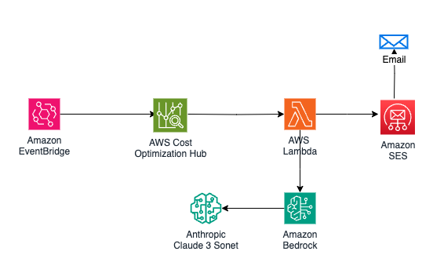

# AWS Cost Optimization Recommendations

An automated solution that analyzes AWS cost optimization recommendations and sends weekly reports using AWS Lambda, EventBridge, Cost Optimization Hub, Amazon SES, and Amazon Bedrock.

## Overview

This solution automatically generates and emails weekly cost optimization reports by analyzing your AWS infrastructure using AWS Cost Optimization Hub. It leverages Amazon Bedrock for intelligent summarization of recommendations and delivers detailed reports via Amazon SES.

## Architecture Components

- **AWS Lambda**: Processes cost analysis and generates reports
- **Amazon EventBridge**: Schedules weekly executions
- **AWS Cost Optimization Hub**: Provides cost optimization insights
- **Amazon SES**: Handles email delivery
- **Amazon Bedrock**: Generates natural language summaries

## Prerequisites

1. AWS Account with appropriate permissions
2. Verified sender and recipient email addresses in Amazon SES
3. Access to AWS Cost Optimization Hub
4. Access to Amazon Bedrock in us-east-1 region
5. AWS CLI (for CLI deployment option)

## Deployment Steps (Console)

1. **Access CloudFormation Console**
   - Log into AWS Console
   - Navigate to CloudFormation service
   - Ensure you're in the desired region
   - Click **Create stack** → **With new resources (standard)**

2. **Upload Template**
   - Select **Template is ready**
   - Choose **Upload a template file**
   - Upload the `cost_optimization_recommendation.yaml` file
   - Click **Next**

3. **Configure Stack**
   - Stack name: `cost-optimization-stack`
   - Parameters:
     - `EmailRecipient`: Enter recipient email address
     - `EmailSender`: Enter SES verified sender email
   - Click **Next**

4. **Review and Create**
   - Review all settings
   - Check the IAM acknowledgment box
   - Click **Submit**

## Features

- Weekly automated cost analysis
- Comprehensive email reports including:
  - Resource-specific recommendations
  - Estimated monthly savings
  - Recommended actions by resource type
  - AI-generated summary
- Detailed CSV attachment
- Concurrent execution control

## Configuration

### Environment Variables
- `EMAIL_RECIPIENT`: Report recipient address
- `EMAIL_SENDER`: SES verified sender address

### Lambda Settings
- Runtime: Python 3.9
- Memory: 256 MB
- Timeout: 5 minutes
- Concurrent Executions: 1

### Schedule
- Runs every Monday at 11:00 AM UTC
- Cron expression: `0 11 ? * MON *`

## Monitoring and Troubleshooting

### CloudWatch Logs
- Log group: `/aws/lambda/CostOptimizationAnalysis`
- Contains execution details and errors

### Common Issues
1. **Email Delivery Problems**
   - Verify SES email addresses
   - Check SES sending limits
   - Review CloudWatch logs

2. **Lambda Execution Failures**
   - Verify IAM permissions
   - Check timeout settings
   - Monitor memory usage

## Security Considerations

- Use IAM roles with minimum required permissions
- Regularly rotate credentials
- Monitor CloudWatch logs for suspicious activity
- Keep Python dependencies updated
- Verify email addresses in SES

## Resource Cleanup

To remove all deployed resources:
1. Go to CloudFormation console
2. Select the stack
3. Click **Delete**
4. Confirm deletion

## Support

For issues and feature requests:
1. Check CloudWatch logs
2. Review IAM permissions
3. Verify SES configuration
4. Create detailed bug reports with logs

## Best Practices

1. **Monitoring**
   - Set up CloudWatch alarms
   - Monitor execution duration
   - Track error rates

2. **Maintenance**
   - Regularly review permissions
   - Update Python dependencies
   - Monitor AWS service quotas

3. **Cost Management**
   - Monitor Lambda execution costs
   - Review CloudWatch logs retention
   - Track SES usage

## License

This project is licensed under the MIT License.

---

**Note**: Ensure all services are available in your region and your AWS account has appropriate service quotas before deployment.
